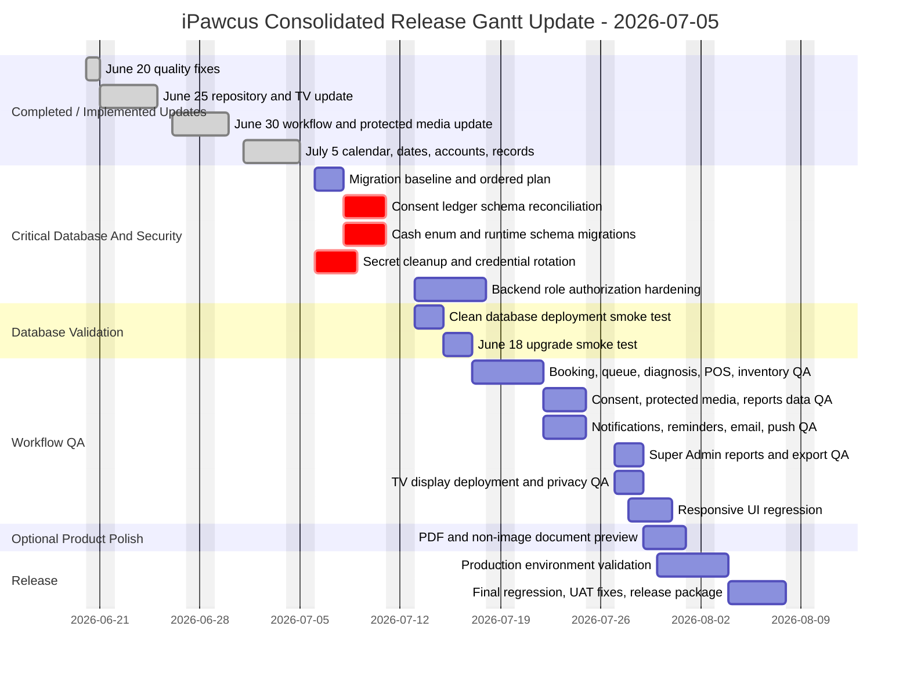

# 2026-07-05 Consolidated Gantt Update

This document combines the current documentation set into one Gantt-ready update for the iPawcus project. Use it to update the existing project Gantt without changing the preserved dashboard debug-bypass behavior.

## Source Documents Combined

- `docs/README.md`
- `docs/system_inventory_gantt_details.md`
- `docs/git_backlog_assumptions.md`
- `docs/tv_status_display_deployment.md`
- `docs/20260705_combined_project_update.md`
- `docs/20260630_project_update.md`
- `docs/20260625_repository_update.md`
- `docs/20260620_quality_fix_notes.md`
- `AGENTS.md`
- `GEMINI.md`
- `README.md`
- `DDL/README.md`
- `Subdomain_folder/README.md`

## Gantt Update Summary

The current project is feature-heavy and mostly implemented, but several deployment and QA blockers remain. The Gantt should be updated from a feature-build chart into a release-hardening chart.

Major completed or implemented areas:

- Authentication, registration, OTP, password reset, and dashboard routing.
- Pet registration, ownership linking, pet profiles, and medical record views.
- Standard bookings, online consultation, home service, boarding, and self-service queue.
- Queue management, veterinarian assignment, diagnosis, EMR, record-update requests, and POS billing.
- Inventory, service catalog, materials-to-stock consumption, stock reversal, and low/expiry/disposal views.
- Consent templates, consent capture in booking/queue/diagnosis/boarding flows, and consent-ledger helper support.
- Notification bell, responsive notification page, reminders, preferences, email/push support hooks, and redirect handling.
- Super Admin reports dashboard, report center, print and CSV export.
- Pet owner account controls, staff profile editing, pet media monitoring, and account removal workflow.
- React TV display and standalone PHP TV display.
- July 5 calendar-style TODO scheduling, shared Mantine date input, report date controls, account-directory cleanup, and medical-record change notifications.

Main blockers and remaining work:

- Reconcile the competing `consent_form_records` table definitions before production deployment.
- Add `cash` to `visit_payments.payment_method` before enabling cash POS posting.
- Convert runtime schema updates into explicit production migrations where needed.
- Validate clean database deployment and June 18-to-current upgrade deployment.
- Harden backend route authorization beyond frontend role checks.
- Remove or rotate any real credentials that appear in tracked environment examples or Git history.
- Run full workflow QA for booking, queue, diagnosis, POS, inventory, notifications, reports, TV display, and responsive layouts.
- Add PDF/non-image document preview if required for release.
- Keep dashboard/router debug-bypass values unchanged unless a separate hardening task explicitly authorizes that change.

## Status Changes For Current Gantt

| Existing Gantt Area | New Status | Update To Apply |
| --- | --- | --- |
| Environment setup | Mostly complete | Keep as completed, but add production env validation for frontend, API, Jitsi, mail, push, and TV subdomain. |
| Database baseline | Blocked / critical | Split into baseline import, June 18 upgrade validation, consent schema reconciliation, cash enum migration, and runtime-schema migration cleanup. |
| Auth and registration | Implemented | Move to QA/regression, including OTP expiry, retry behavior, SMTP config, and deactivated-login blocking. |
| Dashboard shell | Implemented | Keep dashboard and dashboard-router debug bypass unchanged; add role navigation regression only. |
| Profiles, theme, preferences | Implemented | Add regression for owner/admin/vet profile image upload, shared theme toggle, password change, notification preferences, and staff profile editing. |
| Pet registry and ownership | Implemented | Add QA for duplicate pets, link/unlink ownership, owner deactivation, pet image upload, and pet status changes. |
| Standard bookings | Implemented | Add lifecycle QA for submit, approve, reject, cancel, reschedule, receive, payment proof, and booking reference numbers. |
| Online consultation | Implemented, environment dependent | Add Jitsi environment validation, vet schedule QA, start/join/end tests, online diagnosis, and reminder notifications. |
| Home service | Implemented | Add assigned consent template, address, transport fee, signature, payment proof, and protected-media QA. |
| Boarding/pet hotel | Implemented | Add liability consent, room setup/capacity, assignment, check-in/out, tasks, observations, documents, and checkout QA. |
| Queue management | Implemented | Add formatted queue references, protected concern media, assignment, return/reenter, lifecycle expiry, and TV-display consistency QA. |
| Veterinarian diagnosis | Implemented | Add optional-vaccination, extra consent, draft persistence, visit charge creation, inventory material consumption, and record notification QA. |
| Medical records | Implemented | Add print, email copy, grouped EMR save, owner notification only on meaningful changes, and document preview follow-up. |
| Record update requests | Implemented | Add urgent/payment notification redirect and admin-vet-owner lifecycle QA. |
| POS/billing | Implemented with schema gap | Add cash enum migration, paid-visit overwrite prevention QA, booking proof linking, payment posting, and stock reversal QA. |
| Service catalog | Implemented | Add deactivation confirmation, materials linked to inventory, and pricing regression. |
| Inventory | Implemented | Add batch selection, stock-in/out, supplier/location, low stock, near expiry, disposal, insufficient-stock, and reversal QA. |
| Consent management | Implemented with schema blocker | Keep feature implemented; block production acceptance until consent ledger schema is reconciled and tested. |
| Notifications | Implemented | Add responsive page QA above/below 720px, filters, paging, redirects, mark-read actions, quiet refresh, reminder runner, email, and push validation. |
| Upload/document preview | Partially implemented | Image preview is supported; add PDF and non-image document preview or metadata/download behavior. |
| TV status display | Implemented | Add React and standalone deployment validation, privacy review, refresh behavior, and Asia/Manila date-boundary tests. |
| Super Admin reports | Implemented | Add representative-data validation, previous-period comparisons, consent fallbacks, CSV, print, and query drift checks. |
| Pet owner account controls | Implemented | Add deactivation/reactivation, login block, ownership unlink, account removal master-key, and notifications QA. |
| Consent record ledger | Blocked / critical | Replace generic task with explicit migration and clean/upgraded database acceptance criteria. |
| Pet media monitoring | Implemented | Add protected media, source/date/pet filters, consent schema dependency, and duplicate-row QA. |
| Lifecycle automation and recovery | Implemented | Add previous-day queue expiry, missed booking reschedule/cancel, recovery report, and billing-link QA. |
| QA and deployment | In progress | Expand into release-hardening tracks below. |

## New Gantt Items To Add

| ID | Task | Priority | Status | Dependency | Acceptance Criteria |
| --- | --- | --- | --- | --- | --- |
| GNT-028 | Calendar TODO scheduling and range persistence | High | Complete | TODO service and `pet_owner_todos.end_at` | Month/week/day/agenda views work; slot and range selection persist start/end times. |
| GNT-029 | Shared date picker standardization | Medium | Complete | Mantine/Day.js dependencies | Date inputs keep `YYYY-MM-DD`, icons align, and booking/report/inventory/profile forms remain usable on mobile and desktop. |
| GNT-030 | Account removal workflow | High | Implemented, needs deployment QA | Account status columns and `MASTER_KEY` | Super Admin can soft-remove eligible staff; self-removal and Super Admin removal are blocked; notifications are created. |
| GNT-031 | Medical-record change notifications | Medium | Implemented, needs QA | Medical record save flow | Owner receives a notification only when meaningful record content changes. |
| GNT-032 | API access tokens and protected media | High | Implemented, needs migration/QA | Login route and media route | API requests carry bearer token; protected media loads for authorized roles and rejects unauthorized access. |
| GNT-033 | Pet-owner assigned consent templates | High | Implemented, needs schema migration | Consent files and booking flows | Online consultation, home service, boarding, and self-service queue load the assigned consent template and persist signature metadata. |
| GNT-034 | Explicit migration set for runtime schema changes | Critical | Open | Database baseline selection | Production deploy has ordered migrations for API tokens, consent contexts, account status, TODO end times, cash enum, and consent ledger columns. |
| GNT-035 | Backend role authorization hardening | High before production | Open | API access token validation | Sensitive PHP endpoints enforce authenticated role checks and return 403 for unauthorized users. |
| GNT-036 | Secret cleanup and rotation | Critical | Open | Deployment configuration review | Example files contain placeholders only; exposed credentials are rotated; Git history risk is reviewed. |
| GNT-037 | Production environment validation | High | Open | Build and deployment config | Frontend, PHP API, Jitsi, mail, push, uploads, TV subdomain, and HTTPS settings work in staging/production-like setup. |

## Recommended Release-Hardening Schedule

Planning assumption: start the next Gantt update on 2026-07-06. Dates are suggested targets and should be adjusted to match actual team capacity.

| ID | Gantt Task | Start | Finish | Status | Dependencies |
| --- | --- | --- | --- | --- | --- |
| M-001 | June 20 quality fixes: phone, logout, dialogs, notifications, rooms | 2026-06-20 | 2026-06-20 | Complete | Existing app |
| M-002 | June 25 repository update: TV display, notification page, profile/report alignment | 2026-06-21 | 2026-06-25 | Complete | M-001 |
| M-003 | June 30 workflow/security update: tokens, protected media, consent assignment, POS/reporting | 2026-06-26 | 2026-06-30 | Implemented | M-002 |
| M-004 | July 5 update: calendar TODOs, shared dates, account removal, record notifications | 2026-07-01 | 2026-07-05 | Complete | M-003 |
| RH-001 | Define production migration baseline and ordered migration list | 2026-07-06 | 2026-07-07 | Open | M-004 |
| RH-002 | Reconcile `consent_form_records` schema | 2026-07-08 | 2026-07-10 | Critical open | RH-001 |
| RH-003 | Add cash enum and runtime-schema migrations | 2026-07-08 | 2026-07-10 | Open | RH-001 |
| RH-004 | Secret cleanup and credential rotation | 2026-07-06 | 2026-07-08 | Critical open | M-004 |
| RH-005 | Clean database deployment smoke test | 2026-07-13 | 2026-07-14 | Open | RH-002, RH-003 |
| RH-006 | June 18 database upgrade smoke test | 2026-07-15 | 2026-07-16 | Open | RH-002, RH-003 |
| RH-007 | Backend role authorization hardening | 2026-07-13 | 2026-07-17 | Open | API access tokens |
| QA-001 | Booking, queue, diagnosis, POS, and inventory lifecycle QA | 2026-07-17 | 2026-07-21 | Open | RH-005, RH-006 |
| QA-002 | Consent, protected media, pet media monitoring, and reports data QA | 2026-07-20 | 2026-07-22 | Open | QA-001, RH-002 |
| QA-003 | Notifications, reminders, email, push, and redirect QA | 2026-07-22 | 2026-07-24 | Open | RH-007 |
| QA-004 | Super Admin reports and export QA | 2026-07-24 | 2026-07-27 | Open | QA-002 |
| QA-005 | TV display deployment and privacy QA | 2026-07-27 | 2026-07-28 | Open | QA-001 |
| QA-006 | Responsive UI regression: phone, tablet, 1080p, large desktop | 2026-07-28 | 2026-07-30 | Open | QA-001, QA-003 |
| FEAT-001 | PDF and non-image document preview | 2026-07-29 | 2026-07-31 | Optional / open | Upload flows |
| REL-001 | Production environment validation: frontend, API, Jitsi, mail, push, uploads | 2026-07-30 | 2026-08-03 | Open | RH-004, RH-007 |
| REL-002 | Final regression, UAT fixes, and release package | 2026-08-04 | 2026-08-07 | Open | QA-004, QA-005, QA-006, REL-001 |
| DEF-001 | Dashboard/router debug-bypass strategy | Unscheduled | Unscheduled | Deferred | Requires separate explicit approval |

## Mermaid Gantt Draft

## Release Acceptance Checklist

- `npm run lint` passes.
- `npm run build` passes.
- PHP syntax checks pass for all changed endpoints.
- Clean database import plus required migrations supports all critical workflows.
- June 18 upgraded database reaches the intended current schema without data loss.
- `consent_form_records` has the columns expected by helpers, reports, media monitoring, and consent flows.
- `visit_payments.payment_method` accepts `cash`.
- Account removal works only for eligible users and requires `MASTER_KEY`.
- Protected media loads for authorized users and is rejected for unauthorized users.
- Backend route authorization is enforced for sensitive PHP routes.
- Booking, queue, diagnosis, POS, inventory, notifications, reports, and TV display pass manual QA.
- Responsive layouts pass phone, tablet, 1080p desktop, and large desktop review.
- No production secrets remain in tracked examples or deployed public files.
